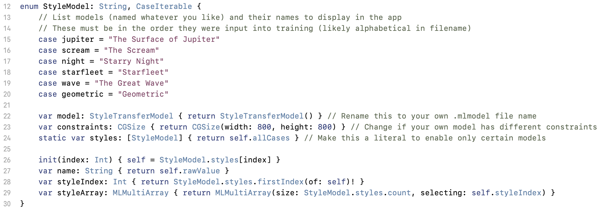
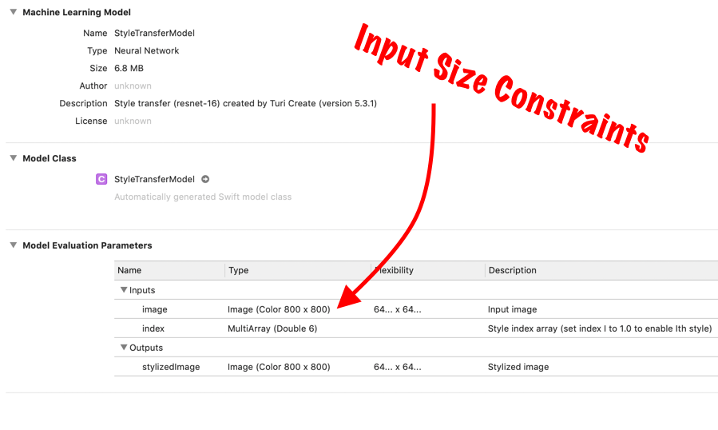

# ReinforceConf2019

This repository includes presentation slides and supplementary material from [Paris](https://twitter.com/parisba) and [Mars](https://twitter.com/TheMartianLife)' presentations in Budapest at the Reinforce AI Conference (presentation\_main) and the nearby Budapest Artificial Intelligence Meetup (presentation\_meetup) in 2019.

Aside from the written content, a simple demo app was written in Swift 5 using the Xcode 10.2 Beta 3 to demonstrate Neural Style Transfer on iOS. This is a quick and easy way to get started experimenting with TuriCreate and CoreML, with visual output that is fun to test.

## Using NSTDemo

### Creating a new MLModel

**(STUFF WILL GO HERE)**

## Modifying code

In the **StyleModel.swift** file, there is the declaration of an enum called **StyleModel**. It looks as follows:

If a new .mlmodel file has been trained to replace the old one, some changes may need to be made.

* the *enum cases* should list all model style options in the order they were input into training (this will often be alphabetical by image filename): the case name can be anything, the String rawValue should be how you want it listed in the app
* the *model* variable type and return value must match the name of your .mlmodel file
* the *constraints* for input size must match those listed in the .mlmodel details (see below)
* the *styles* variable return value can be replaced with an array literal to enable only certain styles to be visible and accessible in the app

And that's it!

## License

NSTDemo is available under the [MIT](https://opensource.org/licenses/MIT) license. See the LICENSE file for more info.

All images used in the creation of models included are [Public Domain](https://creativecommons.org/share-your-work/public-domain/) or from Pixabay (either [CC0](https://creativecommons.org/share-your-work/public-domain/cc0/) or under the [Pixabay License](https://pixabay.com/service/license/)). 

Images featured/style-transferred in screenshots are of--and belong to--the repository authors.